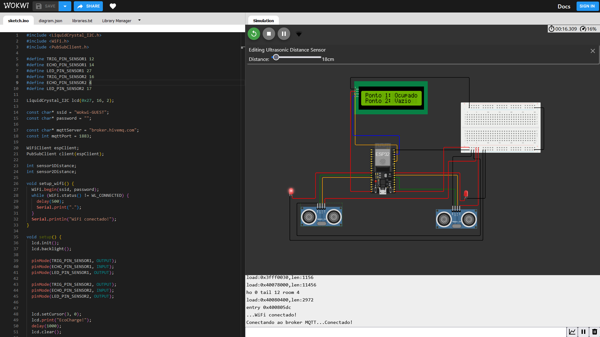
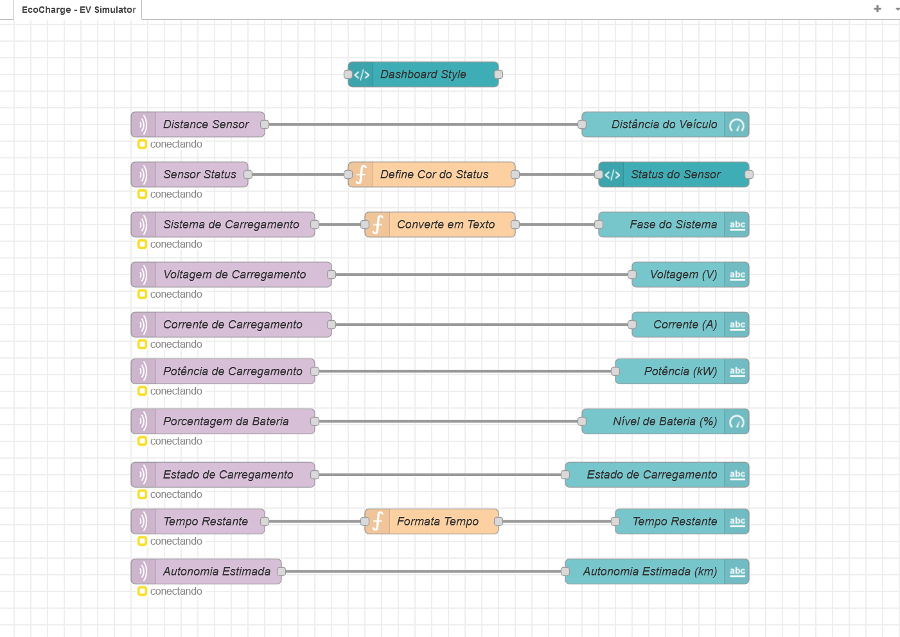
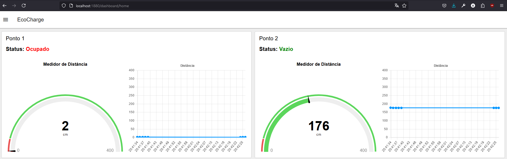

# 🌐 IOT

<details open>
    <summary><h3><strong>📑 Sumário</strong></h3>
        <ol>
            <li><a href="#descricao">Descrição do Projeto</a></li>
            <li><a href="#funcionalidades">Principais Funcionalidades</a></li>
            <li><a href="#tecnica">Descrição Técnica</a></li>
            <li><a href="#pre-requisitos">Pré-requisitos</a></li>
            <li><a href="#estrutura">Estrutura do Projeto</a></li>
            <li><a href="#passos">Passos para Replicar e Testar a Solução</a></li>
            <li><a href="#requisitos">Requisitos do Projeto de IOT</a></li>
            <li><a href="#entregaveis">Entregáveis</a></li>
        </ol>
    </summary>
</details>

<h2>📚 Descrição do Projeto</h2>

Este projeto apresenta um protótipo de **Estação de Carregamento Inteligente para Veículos Elétricos (EV)**, desenvolvido com um ESP32 para simulação no ambiente Wokwi. O objetivo principal é integrar sensores e atuadores, coletar dados em tempo real e exibir informações relevantes sobre o processo de carregamento em um dashboard interativo via Node-RED.

<h2 id="funcionalidades">🛠️ Principais Funcionalidades</h2>

1. **Simulação de Carregamento de EVs**:

   - Mede a distância de um veículo usando um sensor ultrassônico para detectar se a estação está "Vazia" ou "Ocupada".
   - Calcula a potência de carregamento com base na corrente (A), tensão (V), e no tipo de sistema (monofásico ou bifásico).
   - Simula o nível da bateria, autonomia restante e tempo estimado para carga completa.

2. **Protocolo MQTT para Comunicação**:

   - Publica os dados coletados para um broker MQTT, permitindo monitoramento em tempo real.
   - Alterna entre modos de exibição: dados no monitor serial ou envio via MQTT.

3. **Painel de Controle Node-RED**:

   - Dashboard interativo exibe:
     - Status do ponto (Vazio/Ocupado)
     - Potência consumida (kW)
     - Percentual de carga da bateria
     - Tempo estimado para conclusão do carregamento
     - Simulação de autonomia restante do veículo

4. **Simulação Realista**:
   - Alteração dinâmica entre sistemas monofásico e bifásico via chave seletora, duplicando a potência de carregamento no modo bifásico.
   - Ajuste do sensor de corrente para simular diferentes cenários de consumo.

<h2 id="tecnica">📋 Descrição Técnica</h2>

### **Componentes Utilizados**

- **ESP32**: Microcontrolador responsável pelo processamento e comunicação.
- **Sensor de Distância (HC-SR04)**: Detecta a presença de veículos na estação.
- **Sensor de Corrente (ADC)**: Mede a corrente elétrica consumida durante o carregamento.
- **LED**: Indica o status da estação (Carregando/Não carregando).
- **Chave Seletora**: Alterna entre os sistemas monofásico e bifásico.
- **Protocolo MQTT**: Transmite os dados para o broker.

### **Parâmetros Simulados - Modelo BYD Dolphin Mini**

- **Capacidade Máxima da Bateria**: 38 kWh
- **Autonomia Total do Veículo**: 340 km
- **Tensão de Alimentação**: 220V (Semirrápido)
- **Corrente de Carregamento**: Ajustada pelo potenciômetro no ADC.

<h2 id="pre-requisitos">🔧 Pré-requisitos</h2>

1. **Wokwi**: Simulação do hardware ESP32 e componentes associados.
2. **Node-RED**: Gerenciamento do fluxo de dados e criação do dashboard.
3. **MQTT Broker**: Hospedado em `broker.hivemq.com` para troca de mensagens.

<h2 id="estrutura">📁 Estrutura do Projeto</h2>

- **Código Arduino (Wokwi)**: O código do ESP32, está disponível na plataforma Wokwi neste [Link](https://wokwi.com/projects/414012916024807425) e localizado no arquivo `sketch.ino` neste repositório.
- **flows.json**: O arquivo de configuração do fluxo do Node-RED, com todos os nós necessários para visualizar os dados, está disponível neste repositório.

<h2>🚀 Passos para Replicar e Testar a Solução</h2>

### 1. **Configuração do Wokwi (Código Arduino)**

1. Acesse o código Arduino simulado na plataforma Wokwi: [Projeto Wokwi](https://wokwi.com/projects/414012916024807425)
2. Simule o código no Wokwi para garantir que os dados sejam enviados corretamente para o broker MQTT.



> Lembre de trocar o Interruptor abaixo da ProtoBoard para enviar dados para o Broker MQTT.

### 3. **Configuração do Node-RED**

1. Clone o repositório deste projeto (Opcional):

   ```bash
   git clone https://github.com/GSEcoCharge/IOT
   cd IOT
   ```

2. Importe o arquivo `flows.json` no seu ambiente Node-RED:

   - Abra o Node-RED em seu navegador (geralmente acessível por http://localhost:1880).
   - No menu do Node-RED, clique em **Import**.
   - Selecione o arquivo `flows.json` do repositório clonado.
   - Clique em **Importar** para carregar o fluxo no Node-RED.

3. Verifique se o fluxo está configurado para se conectar corretamente ao seu MQTT Broker e exibir os dados recebidos.



### 4. **Configuração do Dashboard**

1.  Caso o Node-RED ainda não tenha a paleta de dashboard instalada, instale a paleta necessária:

    - No menu do Node-RED, vá em **Manage palette**.
    - Busque por `node-red-dashboard` e instale a paleta.

2.  Verifique o painel de controle do Node-RED. O fluxo importado deve configurar um dashboard acessível em http://localhost:1880/dashboard/home, onde você pode visualizar os dados dos sensores e os LEDs.

### 5. **Testando a Solução**

1.  Com o Wokwi simulando o código Arduino e enviando dados via MQTT, abra o dashboard no Node-RED em http://localhost:1880/dashboard/home.
2.  O painel deve começar a exibir as informações do sensor de distância e o Status do ponto (Vazio ou Ocupado), além de simular a Potência do ponto de carregamento e informações sobre a bateria do veículo.
3.  Teste a solução movendo o sensor de distância para simular a presença de um veículo e ajustando o potenciômetro para simular a corrente do ponto de carregamento. (OBS: O Interruptor acima da ESP32 troca a simulação de um sistema monofásico para bifásico, duplicando a velocidade de carregamento)



<h2 id="requisitos">📋 Requisitos do Projeto de IOT</h2>

### Funcionalidades do Projeto

- [x] **Sistema IoT**: Integrar, no mínimo, 2 dispositivos (sensores/atuadores ou ambos), coletando, processando ou interagindo com base nos dados obtidos.
- [x] **Hardware**: Construir a solução utilizando uma das plataformas abordadas em aula.
- [x] **Dashboard**: Implementar um painel de controle para monitorar e/ou controlar em tempo real os dados e ações dos dispositivos IoT.
- [x] **Gateway**: Utilizar Node-RED, thinger.io, Thingspeak ou plataformas similares para gerenciar a comunicação entre dispositivos IoT e o dashboard, incluindo fluxos de processamento, análise e visualização de dados.
- [x] **Protocolos**: Empregar o protocolo MQTT ou HTTP para a troca de mensagens entre dispositivos e gateway.
- [x] **Desenvolvimento**: A solução pode ser desenvolvida e testada no simulador Wokwi ou com hardware real.

### Entregáveis

- [x] **Protótipo Funcional** (até 60 pts): Protótipo operacional da solução IoT, simulado ou real.
- [x] **Documentação** (até 30 pts): Repositório GitHub contendo:
  - [x] Descrição detalhada da solução com texto e imagens.
  - [x] Códigos-fonte.
  - [x] Fluxos do Node-RED (se aplicável).
  - [x] README detalhado com instruções para replicar e testar a solução.
- [ ] **Vídeo de Apresentação** (até 10 pts): Vídeo de até 3 minutos, apresentando a solução, funcionamento e benefícios.

### Entrega Final

- [ ] Arquivo .txt no portal contendo:
  - [x] Nomes dos integrantes do grupo.
  - [x] Link do repositório GitHub.
  - [ ] Link do vídeo no YouTube.
